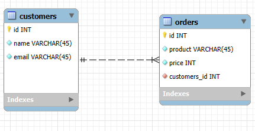

# RUDI APP

## Overview
RUDI APP is a Java-based application that manages customers and orders using JPA and Hibernate. The project includes DAO classes for handling database operations and JUnit tests for ensuring the correctness of these operations.

## Diagramm

